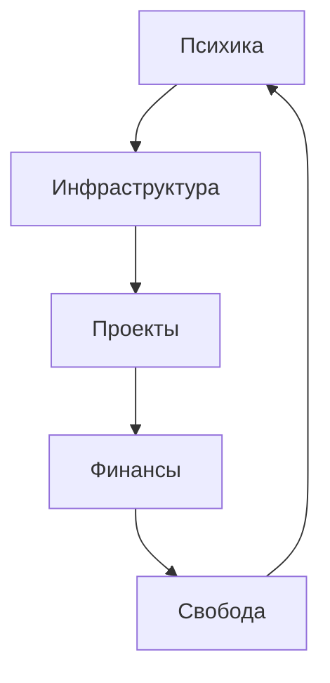

> “Система — это не код. Это способ жить.”  
> — *Твоя внутренняя архитектура*

---

## 🏁 Главный статус

| Параметр | Текущее состояние | Комментарий |
|-----------|------------------|--------------|
| ⚙️ Система | 🟢 Активна | Сервер и ZeroTier в работе |
| 🧠 Ментальное состояние | 🟡 Стабильное | Требуется восстановление энергии |
| 💰 Финансы | ⚙️ В процессе роста | Доходы через Telegram-бот |
| 🎯 Главный фокус | ✳ Завершение планера | Превращение идеи в продукт |
| 🕓 Следующая проверка | {{date+7d:YYYY-MM-DD}} | Еженедельный аудит |

---

## 🧩 Разделы системы

### 🖥️ [Инфраструктура](obsidian://open?vault=YourVaultName&file=I.Инфраструктура)
> Управление серверами, сетями и автономностью  

🔗 Основное:
- [HP DL380p Gen8](obsidian://open?vault=YourVaultName&file=HP-DL380p)
- [ZeroTier и SSH-доступ](obsidian://open?vault=YourVaultName&file=ZeroTier)
- [Proxmox-сервисы](obsidian://open?vault=YourVaultName&file=Proxmox)

🧭 Статус:
- Сервер: 🟢 онлайн  
- VPN: 🟢 стабильный  
- Контроль: 🟡 требует автоматизации  

---

### 💻 [Проекты](obsidian://open?vault=YourVaultName&file=II.Проекты)
> Всё, что создаёт ценность и движение вперёд  

🔥 Активные:
- [365 дней осознанности](obsidian://open?vault=YourVaultName&file=Планер)
- [Telegram-бот с CryptoBot оплатами](obsidian://open?vault=YourVaultName&file=CryptoBot-Бот)
- [Голосовой ассистент (ASR+TTS+GPT)](obsidian://open?vault=YourVaultName&file=Голосовой-Ассистент)
- [Тендерный парсер](obsidian://open?vault=YourVaultName&file=Парсер)
- [Книга "Тревожность"](obsidian://open?vault=YourVaultName&file=Книга-Тревожность)

📈 Этап:
- Создание контента и инфраструктуры монетизации  

✅ Следующее действие:
- Завершить первые 30 дней планера и собрать PDF  

---

### 🧠 [Психологический контур](obsidian://open?vault=YourVaultName&file=III.Психика)
> Центр баланса и внутреннего управления  

🧩 Состояние:
- Энергия: ⚡ 7/10  
- Фокус: 🎯 высок  
- Перегрузка: 🔻 умеренная  

🧘‍♂️ Ежедневный чек:
- [ ] 10 минут тишины  
- [ ] Проверка состояния  
- [ ] Короткое дыхательное упражнение  
- [ ] 1 физическая активность  

📒 Запись дня:  
→ [Журнал осознанности](obsidian://open?vault=YourVaultName&file=Журнал-Осознанности)

---

### 💰 [Финансовый контур](obsidian://open?vault=YourVaultName&file=IV.Финансы)
> Деньги — отражение системности  

💼 Портфель:
- МТС — 2 акции  
- Сбербанк — 1 акция  
- Сберегательный фонд — 4 пая  
- Юань — 3  

💵 Цели:
- Пополнение: **3000 ₽/мес**
- Доход: **15–30 тыс. ₽**
- Цель: **200 тыс. ₽+/мес**

📊 Монетизация:
- Telegram-бот с подписками  
- Продажа PDF-планера  
- AI/голосовые сервисы  

---

### 🧭 [Саморазвитие и обучение](obsidian://open?vault=YourVaultName&file=V.Саморазвитие)
> Эволюция как процесс, встроенный в систему  

📘 Фокусные направления:
- Оптимизация API и асинхронности  
- Локальные модели TTS/ASR  
- Продвинутый Telegram AI Bot  
- Финансовая грамотность  

📅 Цель месяца:
- Изучить и применить Silero TTS  
- Добавить Whisper в голосового ассистента  

---

### 📊 [Стратегическая карта](obsidian://open?vault=YourVaultName&file=VI.Карта)
> Связь всех элементов системы  


💬 **Пояснение:**  
Всё начинается с внутреннего состояния.  
Из фокуса рождается структура, из структуры — результат.

## 🧩 Ежедневный трекер

|Категория|Прогресс|Примечание|
|---|---|---|
|Инфраструктура|🟢|Сервер стабилен|
|Проекты|🟡|Планер в разработке|
|Психика|🟡|Требуется баланс|
|Финансы|⚙️|Монетизация ботов|
|Развитие|🟢|Регулярная работа над собой|
## 🔋 Ритуал включения

> Каждый день начинается с короткого перезапуска системы:

1. ☀️ Проверить физическое состояние
    
2. 💻 Открыть Dashboard
    
3. 🎯 Задать цель дня (1 ключевое действие)
    
4. 📓 Отметить состояние (энергия, фокус)
    
5. 🔄 Синхронизировать с реальностью: _что я делаю и зачем?_

## 📊 Dataview — Журнал состояния


```dataview
TABLE mood AS "Настроение", energy AS "Энергия", summary AS "Кратко"
FROM "02_Журнал"
SORT file.name DESC
LIMIT 7
```

### 🧩 Быстрые ссылки

- [[01_Инфраструктура|Инфраструктура]]
    
- [[02_Проекты|Проекты]]
    
- [[03_Психика|Психика]]
    
- [[04_Финансы|Финансы]]
    
- [[05_Саморазвитие|Развитие]]
    
- [[06_Карта|Карта системы]]

## 🔋 Ритуал перезапуска
- ☀️ Вдох — выйти из потока шума
    
- 🧘‍♂️ Проверить внутренние показатели
    
- 🗓 Открыть [[02_Журнал]] и зафиксировать состояние
    
- ⚙️ Запустить главное действие дня
    
- 🕯 Подвести итог перед сном

```pgsql

---

## 💻 Dataview-запросы для статусов проектов

Добавь в `02_Проекты.md`:

```markdown
# 💻 Проекты

> "Проекты — отражение системного сознания."

```dataview
TABLE status AS "Статус", deadline AS "Дедлайн", priority AS "Приоритет"
FROM "02_Проекты"
WHERE type = "project"
SORT priority DESC

```
