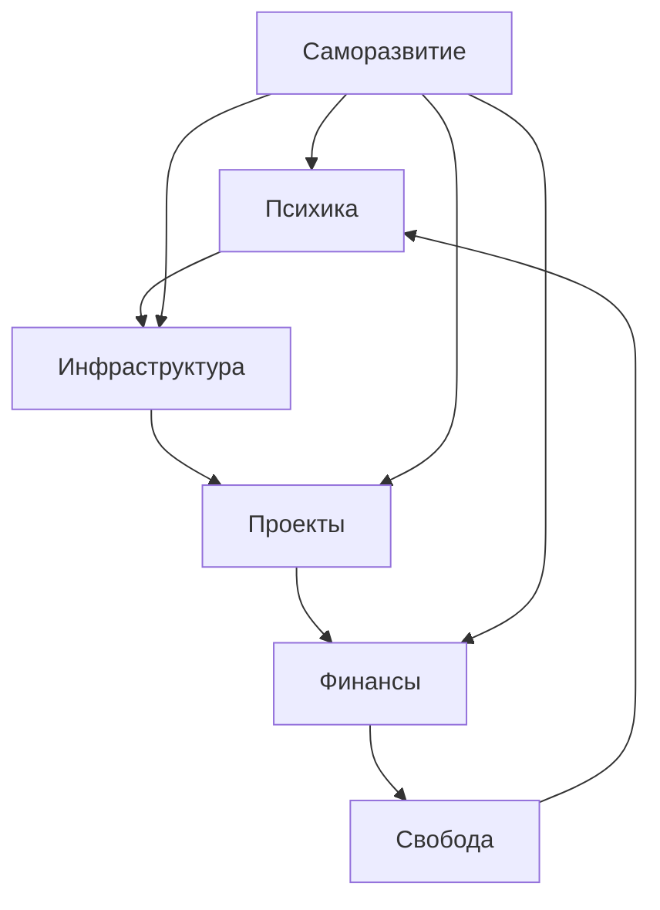

# 🕸️ Карта связей — System MOC

> “Всё связано. Понимание — это увидеть связи.”  
> — *Системная мудрость*

---

## 🌐 Основные узлы

- [[00_Dashboard|Панель управления]]
- [[01_Инфраструктура|Инфраструктура]]
- [[02_Проекты|Проекты]]
- [[03_Психика|Психологический контур]]
- [[04_Финансы|Финансовый контур]]
- [[05_Саморазвитие|Развитие и обучение]]
- [[06_Карта|Стратегическая карта]]

---

## 🔗 Взаимосвязи

### 🧠 Психика ↔ Проекты
> Внутреннее состояние определяет эффективность реализации идей.

- [[03_Психика]] поддерживает стабильность [[02_Проекты]]
- [[02_Проекты]] влияют на уровень энергии в [[03_Психика]]

---

### 💻 Инфраструктура ↔ Проекты
> Без устойчивой системы невозможен рост проектов.

- [[01_Инфраструктура]] обеспечивает техническую базу [[02_Проекты]]
- [[02_Проекты]] проверяют надёжность [[01_Инфраструктура]]

---

### 💰 Финансы ↔ Инфраструктура
> Денежный поток укрепляет систему и обеспечивает автономность.

- [[04_Финансы]] финансируют развитие [[01_Инфраструктура]]
- [[01_Инфраструктура]] снижает издержки [[04_Финансы]]

---

### 🧩 Саморазвитие ↔ Всё остальное
> Обновление ядра личности ведёт к эволюции всей системы.

- [[05_Саморазвитие]] = фундамент адаптации  
- Каждое улучшение → отражается на всех узлах

---

## 📊 Mermaid-граф связей

## 🧭 Навигация по контенту

|Категория|Ссылка|Назначение|
|---|---|---|
|🧭 Главная|[[00_Dashboard]]|Центр системы|
|⚙️ Инфраструктура|[[01_Инфраструктура]]|Сервер, ZeroTier, Proxmox|
|💻 Проекты|[[02_Проекты]]|Telegram-бот, планер, ассистент|
|🧠 Психика|[[03_Психика]]|Осознанность, баланс|
|💰 Финансы|[[04_Финансы]]|Портфель, доходы|
|📚 Развитие|[[05_Саморазвитие]]|Изучение технологий|
|🗺️ Карта|[[06_Карта]]|Стратегическое видение|
|🕸️ Сеть|_Этот файл_|Главная нейронная карта|

