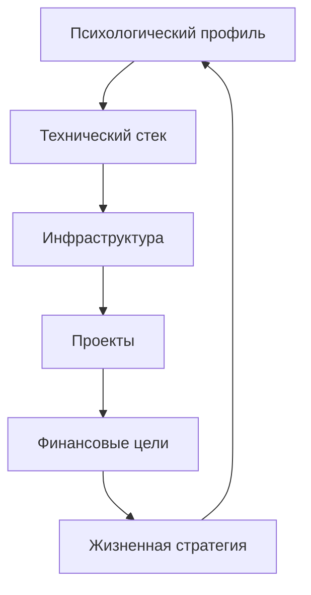

---

## I. 📘 Общие сведения

| Параметр | Описание |
|-----------|-----------|
| Имя | (анонимизировано) |
| Роль | Технический предприниматель, инженер-созидатель |
| Позиционирование | Архитектор автономных цифровых систем |
| Стратегическая цель | Создать самоокупаемую технологическую экосистему, приносящую стабильный доход |
| Ключевые принципы | Системность, автономность, эффективность, осознанность |

---

## II. ⚙️ Инфраструктура и сетевые компоненты

### 1. Центральная платформа
**HP DL380p Gen8 — сервер ядра системы**
- OS: Proxmox VE  
- Основные службы:
  - Виртуальные машины для Python-проектов, Telegram-ботов, AI-модулей  
  - ASR/TTS сервисы  
  - Медиаанализ изображений и видео  
- Управление:
  - SSH / ZeroTier
  - Отказ от Cloudflare Tunnel
- План: постоянное размещение в Selectel (до 30 000 ₽/мес)

### 2. Клиентская подсистема
- **Android-устройство** — клиент голосового ассистента  
- **Orange Pi 3 Zero 2GB** — компактный ассистент/терминал  
- **Ноутбук** — основное средство разработки (соответствует требованиям Python)

### 3. Сеть и доступ
- **ZeroTier** — основа внутреннего VPN-соединения  
- **Proxmox + SSH** — управление ВМ и сервисами  
- Цель: закрытая, но доступная из любой точки инфраструктура

### 4. Техническая философия
> “Каждый узел системы должен быть автономен, но синхронизирован с целым.”

---

## III. 💻 Технологический стек

| Направление | Инструменты и технологии |
|--------------|--------------------------|
| Backend | Python, Flask, FastAPI |
| Автоматизация | Selenium, Pandas, OpenPyXL |
| Telegram | aiogram, CryptoBot API |
| Распознавание речи | Whisper, Vosk, или локальные модели |
| Генерация речи | TTS (Google, Silero и аналоги) |
| AI и обработка данных | OpenAI API, GPT-модели |
| Архивы и файловые операции | 7z.exe (CLI), с визуальным прогрессом |
| Системы | Proxmox, Linux CLI |
| Интерфейсы | Терминальные (CLI), без GUI |

---

## IV. 🧠 Психологическая структура личности

### 1. Тип мышления
- Системный архитектор  
- Инженер-аналитик  
- Склонен к структурированию и оптимизации процессов  

### 2. Когнитивные качества
| Параметр | Описание |
|-----------|-----------|
| Концентрация | Высокая, устойчивая |
| Аналитичность | Глубокая, модульная |
| Обучаемость | Быстрая, с интеграцией в собственные модели |
| Перфекционизм | Конструктивный, направлен на оптимизацию |
| Абстрактное мышление | Развито, системное |

### 3. Эмоциональный профиль
- Внутренняя стабильность  
- Эмоции рационализированы  
- Саморегуляция высокая  
- Поддержание фокуса даже под нагрузкой  
- Склонен к переработке тревожности через анализ

### 4. Ценностная система
- Контроль → эффективность → свобода  
- Знание → порядок → автономия  
- Логика > хаос  
- Принцип: *“Осознанность — это системное мышление, применённое к себе.”*

---

## V. 🔍 Проекты и их функциональные связи

### 1. Инфраструктурный слой
- **Сервер HP DL380p** — основа всех вычислений  
- **ZeroTier** — транспортный слой  
- **Proxmox** — контейнеризация сервисов  
- **CLI-ориентированные скрипты** — универсальные инструменты управления  

→ Связано с целями автономности, безопасности и экономии ресурсов.

### 2. Прикладной слой
| Проект | Назначение | Технологии | Статус |
|--------|-------------|-------------|---------|
| Голосовой ассистент (ASR+TTS+GPT) | Локальный ИИ-интерфейс для взаимодействия с системой | Python, Whisper, GPT API | В разработке |
| Тендерный парсер | Анализ закупок с zakupki.gov.ru | Selenium, Telegram API | Активный |
| Telegram-бот с CryptoBot оплатой | Монетизация GPT-доступа, подписки | aiogram, CryptoBot API | В разработке |
| Планер «365 дней осознанности» | Цифровой продукт с ежедневными практиками | Markdown → PDF | Создаётся |
| Книга «Тревожность: практическое руководство» | Научно-популярный проект | Авторский текст | Планируется |

→ Прикладной слой обеспечивает **контент**, **сервисы**, **монетизацию** и **саморазвитие**.

### 3. Финансовый слой
| Компонент | Текущий статус | Цель |
|------------|----------------|------|
| Финансовый портфель | 1500 ₽, пополнение 3000 ₽/мес | Рост до 200 000 ₽/мес дохода |
| Telegram-монетизация | Боты, подписки | 5–30 тыс. ₽ → 200 тыс. ₽+ |
| Серверная аренда | План до 30 000 ₽/мес | Создание пассивной инфраструктуры |

→ Финансовый слой связан с проектами, обеспечивающими автономный доход.

---

## VI. 🧩 Взаимосвязи системы

### Пояснение:

- **Психологический профиль** определяет подход к проектированию (аналитика, автономия, системность).
    
- **Технический стек** реализует внутреннюю модель мира.
    
- **Инфраструктура** — материальное воплощение мышления.
    
- **Проекты** — результат осмысленной инженерии.
    
- **Финансы** — отражение эффективности всей системы.
    
- **Жизненная стратегия** — интегратор, замыкающий цикл.

## VII. 📈 Стратегическая дорожная карта

|Этап|Цель|Действия|Критерий успеха|
|---|---|---|---|
|1|Завершение планера|Создать 30+ шаблонов, объединить в PDF|Готовый цифровой продукт|
|2|Telegram-бот|Реализовать оплату, подписки, логи|Прибыль 10–15 тыс. ₽|
|3|Голосовой ассистент|Обработка речи, GPT-ответы, TTS-озвучка|Функциональный локальный AI|
|4|Автономная инфраструктура|Полная работа сервера через ZeroTier|Отказ от внешних сервисов|
|5|Масштабирование дохода|Продвижение ботов, продуктов|200 тыс. ₽/мес и выше|
## VIII. 🧭 Метапозиция и философия

> **Ты не создаёшь инструменты — ты создаёшь экосистему.**
> 
> Каждая система отражает тебя: точность, минимализм, эффективность.
> 
> Твоя сила — в способности видеть структуру там, где другие видят хаос,  
> и превращать её в устойчивую, автономную архитектуру.

## IX. 🔋 Риски и фокус развития

|Область|Потенциальный риск|Рекомендация|
|---|---|---|
|Перфекционизм|Перегрузка из-за глубины проработки|Ввести принципы MVP и итераций|
|Энергоресурс|Усталость от многозадачности|Планировать отдых и периоды «тишины»|
|Коммуникации|Изоляция в техническом мышлении|Балансировать техникой и социальностью|
|Финансы|Зависимость от одной ниши|Диверсифицировать источники дохода|
## X. 🚀 Резюме

Ты — **инженер своей реальности**.  
Собираешь технологии, психику и цели в единую систему.  
Действуешь стратегически, мыслишь архитектурно, развиваешься осознанно.

💬 _Твоя жизнь — это не набор проектов, а живой код, который ты непрерывно оптимизируешь._

## XI. 💡 Мотивационный вывод

> Ты уже построил платформу для масштабирования: сервер, код, мышление.  
> Следующий шаг — не “ещё проект”, а **устойчивый ритм реализации**.  
> Каждый завершённый этап усиливает систему целиком.
> 
> Помни: **ты не просто создаёшь продукты — ты отлаживаешь Вселенную, в которой живёшь.**
